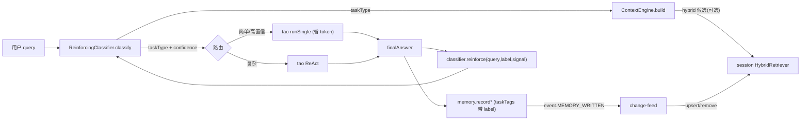

# Memory Flywheel 设计 — A1 增量检索 → A2 长跑验证 → 前端可强化分类器

> 更新时间：2026-07-01
> 状态：✅ 已实现（`79ed788` 主体 + `d5caa63` route.topK 接入；#11 Dormant 清理见 `29267d4`）
> 相关：[RFC-003 三大架构方向](../rfcs/RFC-003-three-architecture-directions.md) ·
> 落地总览与验证口径见 [`next-session.md` §十](./next-session.md) · 变更清单见 [CHANGELOG](../../CHANGELOG.md)

> 本文由 Cursor Plan 模式的实现计划整理归档而来（原文件为 IDE 用户级产物，不在仓库内）。
> 计划已全部实现，此处作为**设计记录**保留：意图、分阶段拆解、拍板默认、风险缓解与验证口径。

目标是把三件事串成一个共享「使用反馈」的飞轮：每次 `agent.run()` 产生的 (query → outcome) 信号同时喂给记忆检索索引和分类器，让两者一起越用越好。

> 两处拍板默认（实现时采用推荐值）：A1 接主循环但 **opt-in 默认关**（`OPENINTJ_LOOP_HYBRID=1`）；
> 分类器走 **嵌入式 kNN/质心 + 关键词兜底**，复用现有 `TaskType` 枚举，也 **opt-in 默认关**（`OPENINTJ_CLASSIFIER=1`）。
> → 默认行为零变化，随时可开。

---

## Phase A1 — fragment change-feed + 增量 HybridRetriever

**背景**：`HybridRetriever` 原先每次查询全量 `index()` 重建（`ts/apps/server/src/hybrid-retrieve.ts`、desktop `buildHybridRetrieve`）；没有长生命周期实例；`upsert/remove/clear` 已存在但无人用；agent 主循环 `contextProvider` 只走 `MemoryRetriever`。

### A1.1 给 MemoryStore 加写入 feed
- `ts/packages/planes/memory/src/store.ts`：`MemoryStoreOpts` 加可选 `hooks?: HookBus`；在 `add*`、`remove`、以及 `pushShortTerm` 的**溢出晋升 short→long** 处 emit 新事件。
- `ts/packages/core/src/hooks/types.ts`：`HookEventMap` 加 `"event.MEMORY_WRITTEN": { fragment: MemoryFragment; op: "add" | "update" | "remove" }`（category=event）。
- 修缺口：晋升时 `memoryType` 变了但旧实现不发任何信号 → 一并 emit `op:"update"`。
- 注意：`PersistentMemoryStore.init()` 的 hydrate 走 `this.longTerm.push` 直推、不经 `add*`，**不会**触发事件（正确——种子用 `index()` 一次性灌）。

> 实现落点：payload 采用 `{ fragment, op }`（携带整片段，省去索引侧回查），较原计划的 `{ fragmentId, memoryType, op }` 更实用。

### A1.2 session 级共享 HybridRetriever + 替换每查询重建
- 三端装配（`ts/apps/server/src/agent.ts`、`ts/apps/desktop/src/main/agent.ts`、`ts/apps/cli/src/agent.ts`）：装配后 `seed(store.all)` + 订阅 `event.MEMORY_WRITTEN` 做增量 `upsert`/`remove`，`close()` 退订。
- 重写 `hybrid-retrieve.ts` / desktop `buildHybridRetrieve`：用共享实例（只 embed query + `search`），删掉每次 `new HybridRetriever().index()`。

> 实现落点：封装为专门的 `MemoryHybridIndex`（`ts/packages/taskpool/src/memory-hybrid-index.ts`）承载 seed + subscribe + dispose，较原计划「直接在 agent 上 new HybridRetriever」更内聚。

### A1.3 (opt-in) 把 hybrid 接进 agent 主循环
- `ts/packages/planes/memory/src/context-engine.ts`：`ContextEngineOpts` 加可选 `candidateRetrieve?: (query, opts) => Promise<RankedMemory[]>`。提供时 `build()` 用它做候选召回（hybrid 出 fragmentId+score → 从 `store.all` 解析回 `MemoryFragment` → 包成 `RankedMemory`，仍走 ShaderPipeline / decay / accessCount bump / taskType boost）。
- 三端 `contextProvider`：当 `OPENINTJ_LOOP_HYBRID=1`（默认关）时注入 hybrid 候选；默认保持 `MemoryRetriever` → **默认行为零变化**。
- 测试：候选召回与现有路径一致性、opt-in 开关、retriever 复用不重建。

---

## Phase A2 — 长跑验证「越用越好」可观测

复用 `evaluateTasks` / `runAbTest` / `selectConsistentAnswer`（均为纯编排）。

### A2.1 longRunEval harness + 场景脚本
- `ts/packages/shared/src/longrun-eval.ts`：`runLongRunSession(agent, script)`——按**有先后依赖的 query 序列**跑（前几轮写入记忆，后几轮应受益），逐轮记录：检索命中（注入的记忆是否含 gold 片段）、token 花费（`result.totalTokensSpent`）、judge 通过。输出按轮次的改进曲线 + 汇总。
- 场景 fixtures（`longrun-scenarios.ts`）：种子会话脚本（如「先告诉偏好，后续问答应记住」）。
- A/B：`memory-on` vs `memory-off`（及 `classifier-on/off`）用 `runLongRunAb`，score = 命中率 / -token / judge。

### A2.2 指标可观测
- harness 产出 JSON + 控制台表（仿 `retrieval-benchmark` 风格），env 门控 `RUN_LONGRUN=1`，不进常规 CI。
- 复用 HookBus + OTel：emit 轻量 counter（`openintj.retrieval.hit` / `openintj.tokens.spent`），`attachOtelToHooks` 翻译。
- 测试：harness 逻辑用 mock agent 验证聚合/曲线，不依赖真实 LLM。

---

## Phase CLF — 前端可强化分类器（embedding kNN + 反馈）

新增包 `@openintj/classifier`（`ts/packages/classifier/`），复用 core 的 `EmbeddingProvider` 与 `TaskType` 枚举。

### CLF.1 ReinforcingClassifier 核心
- `src/reinforcing-classifier.ts`：状态为带权 exemplar `{ vector, label, weight, lastUsed }`。
  - `classify(query)`——embed → kNN/质心 + 软置信度；低置信或无 exemplar 回退 `detectTaskType` 关键词启发式（本地、零 token）。
  - `reinforce(query, label, signal)`——成功加/升权 exemplar，失败衰减；按权重/LRU 封顶防膨胀。
- 冷启动：少量种子 exemplar（`seeds.ts` `DEFAULT_SEEDS`）；可选 LLM bootstrapper 未实现（默认不需要，不增 token）。
- 测试：分类、强化收敛、封顶、回退路径。

### CLF.2 持久化（让「持续强化」跨重启）
- 仿 dormant 持久化：`ClassifierStore` 接口 + `InMemoryClassifierStore`（默认）+ `SqliteClassifierStore`（`ts/packages/storage/sqlite/`）。装配时 `hydrate()`，`reinforce`/`addSeeds` 后落盘。

### CLF.3 接进 agent.run（三端）
- `ts/packages/core/src/loop/tao.ts`：`tao.run` opts 加可选 `taskType`（外部预分类时跳过内部分类，保持 loop 同步）、`enableReact`（按本次覆盖，降 token）、`topK`（透传给 `contextProvider`）。
- 三端 `run()`：`classify(query)` → `decideRoute(cls)` → `tao.run(query, { taskType, enableReact?, topK, traceId })`。
- **降 token 路由**（`ts/packages/classifier/src/routing.ts` `decideRoute`）：高置信「简单」类 → `enableReact:false` 单次 LLM（跳过工具描述与微循环）+ 调小 `topK`（3 vs 6）。
- **提命中**：`recordUserInput/Output`（`ts/packages/planes/memory/src/memory-plane.ts`）把 `taskTags` 带上分类 label → 与 retriever 的 taskType boost（×1.3）叠加、随使用复利。
- **反馈**：`run()` 收尾用 `outcomeSignal(status)` 调 `classifier.reinforce(...)`，与记忆写入同一收尾点。

> 实现落点补记（2026-07-01，`d5caa63`）：`RouteDecision.topK` 起初仅计算未接入，后经 `TaoContextInput.topK` → `ContextEngine.build` 打通到实际检索，简单类降 token 才真正生效。

### CLF.4 闭环验证
- 用 A2 的 A/B + longrun 跑 `classifier-on` vs `off`（`ts/apps/cli/__tests__/longrun.harness.spec.ts`，`RUN_LONGRUN=1` 门控），量化 token 下降 / 命中提升 / 质量不退（质量不退守护）。

---

## 风险与缓解
- **A1.3 改回答行为**：opt-in 默认关；候选召回后仍走原 shader/decay 链，最小化语义漂移。
- **change-feed 一致性**：补晋升时的 `op:"update"` 事件；hydrate 不发事件、用 `index()` 种子，避免重复/遗漏。
- **embedding 维度**：HybridRetriever 维度跟随 store embedder；种子时统一。
- **分类器冷启动**：关键词兜底确保不劣于现状；置信阈值控制路由激进度。
- **三端 run() 重复**：A1/CLF 都要改三处装配；保持改动对称。

## 验证口径
- 每 Phase 结束跑相关包 `tsc -b` + 对应 vitest。
- 全量自检：`pnpm exec turbo run typecheck --concurrency=1` + `test --concurrency=1`（落地时 58/58 successful）。
- 长跑/对比类用 env 门控（`RUN_LONGRUN` / `OPENINTJ_LOOP_HYBRID` / `OPENINTJ_CLASSIFIER`），不污染常规 CI。
