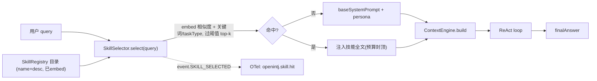

# 技能系统设计 — Phase 1 作者能力包（SKILL.md）+ Phase 2 自学习铺垫

> 更新时间：2026-07-01
> 状态：✅ Phase 1 已实现（新包 `@openintj/skills` + 三端 opt-in 注入 + 可观测；提交后回填 commit）
> 相关：落地总览与验证口径见 [`next-session.md` §十一](./next-session.md) ·
> 变更清单见 [CHANGELOG](../../CHANGELOG.md) · 与飞轮同哲学（使用反馈）见 [`phase-flywheel-design.md`](./phase-flywheel-design.md)

> 本文由 Cursor Plan 模式的实现计划整理归档而来（原文件为 IDE 用户级产物，不在仓库内）。
> Phase 1 已全部实现，此处作为**设计记录**保留：意图、分阶段拆解、拍板默认、风险缓解与验证口径；Phase 2 仅铺垫。

## 目标与拍板

把可复用的做法沉淀成**能力包**，让 agent「越用越会用」，且不牺牲默认行为：

- **本质**：混合分期 —— Phase 1 作者编写的能力包（`SKILL.md`），Phase 2 再加自学习蒸馏。
- **价值**：按需加载省 token（B）+ 与 memory/classifier 飞轮联动的自我进化铺垫（C）+ 清晰的扩展方式（D）。
- **激活**：两级 —— 轻量目录 + 嵌入检索预筛，命中才注入全文（复用 memory embedder）。
- **存储**：文件系统 `SKILL.md`（markdown + frontmatter），背后是可插拔 `SkillSource`；Phase 2 加 DB 源。
- **默认全关**：开关 `OPENINTJ_SKILLS=1`，与 `OPENINTJ_LOOP_HYBRID` / `OPENINTJ_CLASSIFIER` 一致 → 默认行为零变化。
- **Phase 1 技能 = 上下文/指令包**：只注入指令文本 + 对工具的「建议性强调」；不注册新工具、不做工具子集隔离。工具子集/新工具留到后续。

## 运行时流程

注入点沿用现有 persona 模式：三端 `contextProvider` 里把命中的技能块拼进传给 `ContextEngine.build` 的
`systemPrompt`，位置在 persona 之后、`[记忆参考]` 之前。选择按 `(taskType, query)` 记忆化，避免多轮重复 embed。

---

## Phase 1 — 新增包 `@openintj/skills`（`ts/packages/skills/`）

### Skill 类型 + SkillSource 接口 + FsSkillSource
- `types.ts`：`Skill = { id, name, description, triggers[], taskTypes[], priority, version, body, source }`；
  `SkillSource = { name; load(): Promise<Skill[]> }`；`SelectedSkill = { skill, score }`。
- `frontmatter.ts`：极简 frontmatter 解析（标量 / 内联数组 `[a,b]` / 块状列表 / 引号 / `#` 注释），**不引 YAML 依赖**。
- `fs-source.ts`：`FsSkillSource` 递归发现 `SKILL.md` 并解析——`description`/`body` 缺失即跳过、非法 `taskType` 过滤、
  `id` 兜底目录名、单文件解析失败不影响其余、同 id「后源覆盖」（用户目录可覆盖内建）。
  `resolveSkillDirs(builtinDir, env)`：内建 + `OPENINTJ_SKILLS_DIR`（分号/逗号分隔，**不切**盘符冒号，防误伤 `C:\`）。
  `builtinSkillsDir()`：用包自身 `import.meta.url` 解析到 `../skills`，src(vitest/tsx) 与 dist(构建后) 一致，与调用方 cwd 无关。

> 实现落点：种子 `SKILL.md` 随包 `files: ["dist","skills"]` 发布，绑在包目录而非仓库根 —— 三端不管 cwd 都能发现内建技能，用户技能走 `OPENINTJ_SKILLS_DIR`。

### SkillRegistry + SkillSelector + renderSkillPrompt
- `registry.ts`：多源 `load()`（后源覆盖同 id）→ 用注入 embedder 预计算「name + description + triggers」匹配向量；
  `list()`/`size`/`vectorFor(id)`/`catalog()`（第一级轻量目录，留给调试/未来 LLM-pick）。
- `selector.ts`：`select(query, {taskType?})` = embed 余弦 + trigger 子串关键词加成（默认 +0.15）+ taskType 命中加成（默认 +0.1），
  过阈值（默认 0.35）降序取 top-k（默认 2），再按正文 token 预算封顶（默认 700，**至少保留最高分一个**）。
  `renderSkillPrompt(selected)` → `[技能]` 系统块（空则 `""`）。

### 共享装配 helper（三端对称）
- `agent-helper.ts`：`assembleSkillContext({ embedder, hooks?, env?, extraDirs?, selector?, memoLimit? })`：
  载入内建 + 环境目录 → 建注册表/选择器 → 返回 `SkillContext.render(query, {taskType?, traceId?})`：
  按 `(taskType,query)` 记忆化（上限默认 128 清空，防长会话无界增长）、命中发 `event.SKILL_SELECTED`；
  无可用技能返回 `undefined`（调用方据此完全跳过注入，零开销）。opt-in 门控由调用方负责（只在开启时 await）。

> 实现落点：抽出该 helper（风险缓解「三端装配重复」），三端各自只写一行装配 + provider 里一次 `render`。

## 集成与可观测

- 三端 `contextProvider` opt-in 注入（`OPENINTJ_SKILLS=1`，也可传 `enableSkills`），复用 `persistentStore.embedder` /
  `memory.store.embedder`；技能块拼在 persona 之后、`[记忆参考]` 之前（CLI 无 persona 直接接 base）。
  CLI 工厂 `assembleAgent` 为同步 → 持有 `Promise<SkillContext|undefined>`，在异步 `contextProvider` 里 await（只解析一次）。
- `HookEventMap` 加 `event.SKILL_SELECTED`（`{ skills:{id,score}[]; query }`，category=event）；
  `attachOtelToHooks` 加 counter `openintj.skill.hit`（每次注入的每个技能各 +1，attribute=skill → 看「哪些技能真在被用」）。
- 种子 `SKILL.md`：`code-review` / `web-research` / `debugging`（`ts/packages/skills/skills/`）。

## 测试与验证口径

- 单测：`fs-source.spec.ts`（frontmatter 各形态 / `resolveSkillDirs` 去重不切盘符 / FsSkillSource 解析+跳过+目录不存在容错）、
  `selector.spec.ts`（后源覆盖 / 嵌入命中与不命中 / 关键词加成抬过阈值 / topK 限制 / token 预算封顶 / 空查询空表 / renderSkillPrompt）。
  确定性靠**注入 bag-of-words stub embedder**（默认 SimpleEmbedder 是哈希向量，语义不可断言）。
- `metrics.spec.ts` 加 `openintj.skill.hit` 例（按 skill 维度累计）。
- 自检：`turbo run typecheck --concurrency=1` 全绿；touched 包 vitest 单 fork 全过；biome 全过。
  ⚠️ 本机内存吃紧，`turbo run test` 默认多线程 worker 会 OOM（`Zone Allocation failed`）——需 `--pool=forks --poolOptions.forks.singleFork=true` + 调大 `--max-old-space-size` 逐包跑。

## Phase 2（本次仅铺垫，不落地）

- 新增 DB `SkillSource`（`@openintj/storage-sqlite`）承载「学习出来」的技能，接口与 Phase 1 一致（注入点/选择器不变）。
- 从成功轨迹蒸馏候选技能 → 人审批（复用 dormant 的 propose/approve/inject 模式）→ 写入 DB 源。
- 用 `event.LOOP_ITERATION` / `outcomeSignal` 给技能选择加权重（与 classifier 同哲学），实现「越用越好」。
- 工具子集 / 技能绑定新工具（Phase 1 只注入指令文本，不动 `ToolHub`）。

## 风险与缓解

- **注入漂移改回答**：opt-in 默认关；阈值 + top-k + 预算封顶控制注入量；不命中即零变化。
- **每轮重复 embed**：按 `(taskType,query)` 记忆化；技能向量启动时预计算缓存。
- **三端装配重复**：抽 `assembleSkillContext` 共享 helper，保持与 persona/hybrid/classifier 对称。
- **embedding 维度**：技能向量跟随 store embedder，启动统一。
- **种子发现依赖 cwd**：改用 `builtinSkillsDir()`（包自身 `import.meta.url`）绑定包目录，与运行目录无关。
