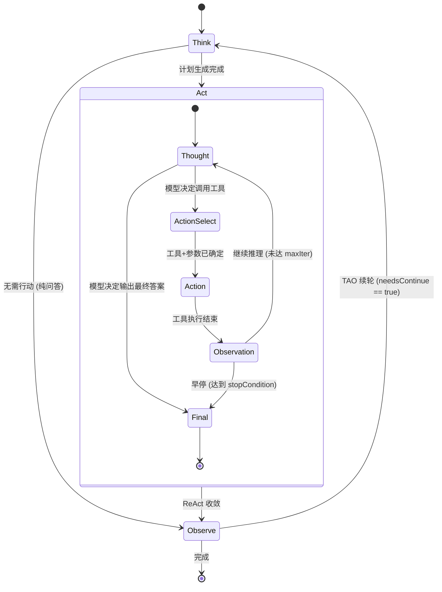

# RFC-001：TAO 宏循环与 ReAct 微循环的层级关系

| 字段 | 值 |
|---|---|
| 状态 | Draft |
| 起草日期 | 2026-04-29 |
| 决策日期 | TBD（Phase 1 启动前） |
| 作者 | OpenINTJ Core |
| 上游决策 | 路线图 D1（外层 TAO + 内层 ReAct，已确认） |
| 影响包 | `@openintj/core` (`packages/core/loop/`)、`@openintj/plane-execution`、`@openintj/plane-control` |

---

## 1. 背景与问题

[v2.0 Python 参考实现](../architecture/python-reference.md) 中，`AgentLoop` 跑的是 **5 阶段宏循环** ([agent_loop.py:143-196](../../agent_loop.py))：

```
PERCEIVE → DECIDE → ACT → OBSERVE → REFLECT
```

每次用户请求只跑一遍循环。`_act` 阶段只是把计划步骤丢给 `Executor.execute` 顺序执行，并未在 LLM 调用 ↔ 工具调用之间多轮迭代——这意味着：

- 模型一次决定要用哪些工具，工具失败也无法基于"看到的错误"再思考重选
- 对"问→工具→看结果→再问→再工具"的复合任务，模型只能在单轮 prompt 里硬塞一个长 plan，缺少"思考与观察的反馈环"

主流 Agent 框架（LangGraph、AutoGen、Claude Code、OpenClaw）都用 **TAO + ReAct 双层循环** 来同时获得"任务级节奏"和"工具级反馈环"：

- **TAO 宏循环**：任务级，覆盖一次或多次"思考-行动-观察"，决定"是否还要继续"
- **ReAct 微循环**：在 TAO 的 `Act` 阶段内，模型每选一次工具 → 执行 → 把结果回灌到下一轮 `Thought`，循环到模型主动停止或达到上限

本 RFC 决定 **OpenINTJ v3 采用嵌套形式**：外层 TAO，内层 ReAct。

## 2. 与 v2.0 五阶段的映射

```
Python v2.0 五阶段                  TS v3 双层循环
───────────────────────────────    ───────────────────────────
PERCEIVE  (感知)                    Think (吸纳查询、JIT 加载记忆)
DECIDE    (决策)                    Think (规划/分类，与 PERCEIVE 合并)
ACT       (行动)              ──►   Act 阶段内的 ReAct 微循环
OBSERVE   (观察)                    Observe (采集结果、写状态快照)
REFLECT   (反馈)                    Observe 末段（合并入 Observe；指标采集 + 自适应着色器调整）
```

**关键设计决定**：

- v2.0 的 `PERCEIVE` 与 `DECIDE` 合并为 `Think`（两者在 v2.0 实现上几乎是连续的同步逻辑）
- v2.0 的 `REFLECT` 合并入 `Observe` 末段（避免 5 阶段的"REFLECT 几乎只做指标采集"的轻量化阶段）
- v2.0 的 `ACT` 升级为 ReAct 微循环：模型**多轮**自主选择工具，每轮看到上一轮的工具结果

## 3. 状态转换图



外层 TAO 默认跑 1 轮（兼容 v2.0 单轮行为）。如果 `Observe` 阶段判定 `needsContinue == true`（例如计划进度未到 100%），则开下一轮 `Think`，直到 `maxTaoIterations` 或显式终止。

## 4. 接口契约

### 4.1 TAO 主循环

```typescript
// packages/core/src/loop/tao.ts

import type { ZodType } from "zod";
import type { HookBus } from "../hooks/bus.js";
import type { TaskType, ShaderMode, MemoryFragment } from "../types/index.js";

export interface TaoConfig {
  /** TAO 宏循环最大轮数。1 = v2.0 行为；>=2 启用多轮思考。 */
  maxTaoIterations: number;
  /** 单轮 TAO 超时（毫秒）。 */
  taoTimeoutMs: number;
  /** 是否启用 ReAct 微循环。false 时退化为"一次 LLM 调用直接给答案"。 */
  enableReact: boolean;
  /** 内嵌 ReAct 配置。 */
  react: ReactConfig;
}

export interface TaoContext {
  readonly traceId: string;
  readonly query: string;
  readonly imageData?: ImagePayload;
  /** TAO 当前轮次（从 1 开始）。 */
  iteration: number;
  /** 累积的 thought / action / observation 历史。 */
  trajectory: TrajectoryEntry[];
  /** 最后一次的最终答案（Final 状态产出）。 */
  finalAnswer?: string;
}

export interface TaoResult {
  traceId: string;
  status: "completed" | "failed" | "timeout" | "max_iter_reached";
  finalAnswer: string;
  iterations: number;
  reactTotalSteps: number;
  durationMs: number;
  trajectory: TrajectoryEntry[];
  metrics: Record<string, number>;
}

export class TaoLoop {
  constructor(deps: {
    config: TaoConfig;
    hooks: HookBus;
    react: ReactStateMachine;
    /* control / execution / memory / governance / context 通过 hooks 钩入，loop 本身不直接持有 */
  });

  run(query: string, opts?: { imageData?: ImagePayload }): Promise<TaoResult>;
}
```

### 4.2 ReAct 微循环

```typescript
// packages/core/src/loop/react.ts

export type ReactState =
  | { type: "thought"; content: string; iteration: number }
  | { type: "action"; tool: string; params: unknown; iteration: number }
  | { type: "observation"; toolResult: ToolCallResult; iteration: number }
  | { type: "final"; answer: string };

export interface ReactConfig {
  /** ReAct 最大迭代数。建议 8。 */
  maxIterations: number;
  /** 单步超时（毫秒）。 */
  stepTimeoutMs: number;
  /** 早停策略集合。任意一项命中即停止。 */
  stopConditions: ReactStopCondition[];
  /** 工具结果回灌时的最大字符数（防止 token 爆炸）。 */
  observationMaxChars: number;
}

export type ReactStopCondition =
  /** 模型显式输出 "Final Answer:" 标记。 */
  | { kind: "explicitFinal" }
  /** 同一工具+同一参数连续命中 N 次（检测死循环）。 */
  | { kind: "duplicateToolCall"; threshold: number }
  /** 单步失败后立即停止（无重试）。 */
  | { kind: "failFast" }
  /** 累积工具调用 token 超出阈值。 */
  | { kind: "tokenBudgetExceeded"; maxTokens: number };

export interface TrajectoryEntry {
  timestamp: number;
  state: ReactState;
  durationMs: number;
}

export class ReactStateMachine {
  constructor(deps: {
    config: ReactConfig;
    hooks: HookBus;
    /* LLM 与 toolHub 通过钩子或显式构造注入；详见 RFC-002 */
  });

  /**
   * 跑一次完整的 ReAct 微循环。
   * 输入：当前已有的对话/记忆上下文 + 可用工具描述。
   * 输出：最终答案 + 完整 trajectory（按时间排序）。
   */
  run(input: ReactInput): Promise<ReactOutput>;
}

export interface ReactInput {
  context: ContextWindow; // 来自 ContextEngine
  availableTools: ToolDescriptor[];
  taoIteration: number;
}

export interface ReactOutput {
  finalAnswer: string;
  trajectory: TrajectoryEntry[];
  iterations: number;
  status: "ok" | "duplicate_loop" | "max_iter" | "fail_fast" | "token_overflow";
  failedTool?: { tool: string; error: string };
}
```

## 5. 早停策略详细规则

| 策略 | 触发条件 | 默认值 | 退出状态 |
|---|---|---|---|
| `explicitFinal` | LLM 输出包含 `"Final Answer:"` 或调用了名为 `finalize` 的虚拟工具 | 启用 | `ok` |
| `duplicateToolCall` | 连续 N 次出现 `(tool_name, sha256(params))` 元组完全一致 | N=2 | `duplicate_loop` |
| `failFast` | 任一工具调用失败（且 `tool.errorSemantics === "fail_fast"`） | 启用 | `fail_fast` |
| `tokenBudgetExceeded` | 累积工具结果 token > `maxTokens` | 启用，阈值=`ContextBudget.memoryBudget` 的 2 倍 | `token_overflow` |

**早停优先级**：`failFast` > `duplicateToolCall` > `tokenBudgetExceeded` > `explicitFinal` > `maxIterations`。

**配置覆盖**：每个策略在 `ReactConfig.stopConditions` 数组中显式列出；不列出的策略不启用。默认 `[explicitFinal, duplicateToolCall(2), failFast, tokenBudgetExceeded]`。

## 6. 与钩子系统的交互（详见 RFC-002）

TAO 与 ReAct 在每个状态转换点发钩子，方便外部观察/拦截/改写：

| 钩子事件 | 触发位置 | 可改写 payload | 可短路 |
|---|---|---|---|
| `tao.beforeThink` | TAO Think 阶段开始前 | ✅（query / 已加载记忆） | ❌（短路意味着跳过整个循环） |
| `tao.afterThink` | Think 完成、Act 开始前 | ✅（plan） | ❌ |
| `tao.beforeAct` | 进入 Act 前（即 ReAct 启动前） | ✅（availableTools） | ❌ |
| `tao.afterAct` | ReAct 收敛后 | ✅（reactOutput） | ❌ |
| `tao.beforeObserve` | Observe 开始前 | ✅（trajectory） | ❌ |
| `tao.afterObserve` | Observe 末段，决定是否续轮前 | ✅（needsContinue） | ❌ |
| `react.beforeThought` | ReAct 每轮 Thought 开始前 | ✅（context） | ❌（用 stopConditions） |
| `react.beforeAction` | 模型已选定工具，工具调用前 | ✅（tool, params） | ✅（短路 = 跳过该工具，回到 Thought） |
| `react.afterAction` | 工具调用完成 | ✅（toolResult） | ❌ |
| `react.onStopCondition` | 任一 stopCondition 命中 | ❌（只读） | ❌ |

## 7. v2.0 行为对齐测试

`packages/core/__tests__/parity/python-v2.spec.ts` 至少要覆盖：

- 单轮 TAO（`maxTaoIterations=1`） + 不开 ReAct（`enableReact=false`）→ 行为应等价于 v2.0 的 5 阶段单次跑通
- 各 `TaskType` 分类与 `ShaderMode` 自动选择应与 [framework_core.py:236-273](../../framework_core.py) 完全一致
- 自适应模式下 `Reflect` 阶段的 ShaderMode 自动切换（详见 [agent_loop.py:367-372](../../agent_loop.py)）应在 Observe 末段同样发生

## 8. 性能目标

- 单轮 TAO 不计 LLM 调用 < 50ms
- ReAct 单步状态转换 < 5ms
- TAO 整体 P95 < 2 × ( ∑ LLM 调用时长 + ∑ 工具时长 )

## 9. 风险与缓解

| 风险 | 概率 | 影响 | 缓解 |
|---|---|---|---|
| ReAct 死循环（连续相同工具） | 中 | 中 | `duplicateToolCall` 策略 + `react.afterAction` 钩子可注入"反思 prompt" |
| Token 爆炸（工具结果累积） | 中 | 高 | `observationMaxChars` 截断 + `tokenBudgetExceeded` 早停 + ContextEngine 的 session compaction 保底 |
| 外层 TAO 无限轮 | 低 | 高 | `maxTaoIterations` 硬上限 + `taoTimeoutMs` 总超时 |
| 与 v2.0 行为漂移 | 中 | 中 | "行为对齐测试"作为 CI 必须通过项 |

## 10. 落地优先级（Phase 1）

1. 先实现单轮 TAO（`maxTaoIterations=1`） + 单步 ReAct（直接调一次 LLM 给答案）→ 与 v2.0 完全等价
2. 启用 ReAct 多步迭代（含 `explicitFinal` + `failFast` + `maxIterations`）
3. 加入 `duplicateToolCall` + `tokenBudgetExceeded`
4. 启用 TAO 多轮（`maxTaoIterations=N`）
5. 行为对齐测试套件全绿

## 11. 未决问题

- **Q1**：~~ReAct 的 `Final Answer:` 是用 prompt 模板约定还是 OpenAI function calling 协议？~~
  **已决（2026-06-30）：采用文本协议（Thought/Action/FINAL），见 [ADR-001](../architecture/adr-001-react-tool-protocol.md)。**
  理由：本地优先 / 多 provider 中立、可观测、与 Python v2 parity 对齐。该 ADR 记录了代价与"何时回到 function-calling"的触发条件。
- **Q2**：TAO 多轮时的"是否续轮"判据，是 LLM 自评还是规则（计划进度<100%）？（推荐两者皆要，规则做硬下限，LLM 做软判据）

这两个问题在 Phase 1 实现前需要在 issue 中收敛。
