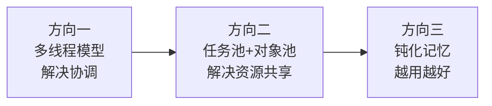
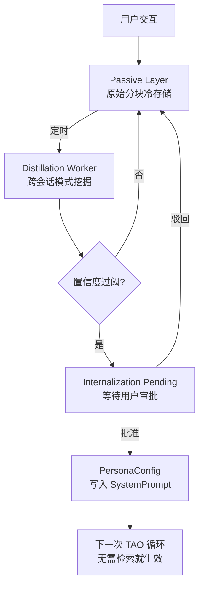
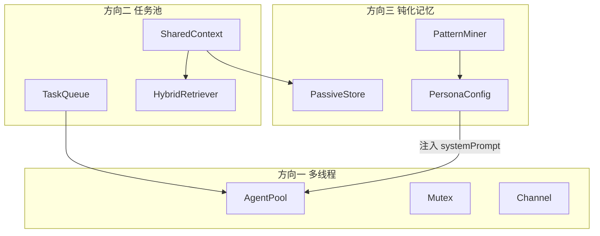

# RFC-003：多线程模型 / 任务池 / 钝化记忆三方向架构

| 字段 | 值 |
|---|---|
| 状态 | Draft |
| 起草日期 | 2026-04-29 |
| 决策日期 | 三方向各自决策（拆 sub-RFC） |
| 作者 | OpenINTJ Core |
| 上游研究 | [docs/agent-architecture-research_20260422.md](../agent-architecture-research_20260422.md) |
| 影响包 | `@openintj/plane-execution`、`@openintj/plane-memory` |
| 实现阶段 | Phase 2（方向一二）+ Phase 4（方向三） |

---

## 0. 总览

[研究文档](../agent-architecture-research_20260422.md) 提出三个方向，本 RFC 把它们落到 v3 TS 端的具体接口契约：

| 方向 | 关键洞察 | 核心包 | Phase |
|---|---|---|---|
| 一、多线程模型 | OS 并发原语（Mutex/Channel/CV/Pool）映射到 Agent 协调；解决 14 种失败模式 | `@openintj/plane-execution/threading` | 2 |
| 二、任务池 + 对象池 | 检索远比写入重要（20pp vs 3-8pp）；原始分块 ≥ 摘要压缩 | `@openintj/plane-execution/task-pool` + `@openintj/plane-memory/retriever` | 2 |
| 三、钝化记忆学习 | 从"存事件"升级到"学模式" → 参数式个性化 | `@openintj/plane-memory/{passive,distillation,internalization}` | 4 |

三者构成递进架构：



---

# 第一部分：方向一 — 多线程 Agent 模型

## 1.1 背景与论文支撑

伯克利 2025 论文 [arxiv:2503.13657 — Why Do Multi-Agent LLM Systems Fail?](https://arxiv.org/abs/2503.13657) 实证：5 大 multi-agent 框架最差正确率仅 25%（不如单 agent）。失败可归结为 14 种模式，进一步归为三类：

| 类别 | 失败模式 | OS 对应解决方案 |
|---|---|---|
| 规则崩坏 | 无内存隔离/权限控制 → 越权写入、覆盖共享上下文 | **Mutex** + Thread-Local Storage |
| 团队内耗 | 无规范化 IPC → 自然语言对话歧义 | **Channel**（结构化 JSON） |
| 验收摆烂 | 无状态同步 → 轮询确认导致死锁/失活 | **Condition Variable** |

## 1.2 接口契约

### 1.2.1 Mutex（互斥锁）

```typescript
// packages/planes/execution/src/threading/Mutex.ts

export class Mutex {
  /** 尝试获取锁，超时返回 false。 */
  tryAcquire(timeoutMs?: number): Promise<boolean>;
  /** 阻塞获取锁。 */
  acquire(): Promise<void>;
  /** 释放锁。 */
  release(): void;
  /** 高阶 API：自动 acquire/release。 */
  withLock<T>(fn: () => Promise<T> | T): Promise<T>;
  /** 当前是否持锁。 */
  readonly locked: boolean;
}
```

实现基于 [`async-mutex`](https://www.npmjs.com/package/async-mutex)，包一层语义化 API。

### 1.2.2 Channel（结构化消息管道）

```typescript
// packages/planes/execution/src/threading/Channel.ts

import type { ZodType } from "zod";

export interface ChannelOptions<T> {
  /** 强制约束消息 schema；违反时 send 抛 ChannelSchemaError。 */
  schema: ZodType<T>;
  /** 缓冲容量；满后 send 阻塞或丢弃（看策略）。0 = 无缓冲（rendezvous）。 */
  capacity: number;
  /** 满策略：block（默认）/ dropOldest / dropNewest / reject */
  fullPolicy?: "block" | "dropOldest" | "dropNewest" | "reject";
}

export class Channel<T> {
  constructor(opts: ChannelOptions<T>);

  /** 发送消息（违反 schema 抛错）。 */
  send(msg: T): Promise<void>;
  /** 阻塞接收。 */
  recv(): Promise<T>;
  /** 非阻塞尝试接收。 */
  tryRecv(): T | undefined;
  /** 关闭通道；之后 send 抛错，recv 立即返回 undefined。 */
  close(): void;
  /** 异步迭代器。 */
  [Symbol.asyncIterator](): AsyncIterator<T>;
}
```

**规约**：multi-agent 间所有通信必须通过 Channel + zod schema，不允许传递裸字符串/裸对象。这把"自然语言对话"问题在工程层面消除。

### 1.2.3 ConditionVar（状态门控）

```typescript
// packages/planes/execution/src/threading/ConditionVar.ts

export class ConditionVar {
  constructor(mutex: Mutex);

  /** 释放 mutex，等待条件满足后重新获取 mutex。 */
  wait(predicate: () => boolean, timeoutMs?: number): Promise<boolean>;
  /** 唤醒一个等待者。 */
  notifyOne(): void;
  /** 唤醒所有等待者。 */
  notifyAll(): void;
}
```

替代"轮询 + sleep"的常见反模式（v2 Python 当前在 `Executor.execute` 里没有任何并行/等待原语，是 Phase 2 才需要的能力）。

### 1.2.4 AgentPool（角色专精的预热池）

```typescript
// packages/planes/execution/src/threading/AgentPool.ts

export interface AgentRoleSpec {
  name: string;                       // "code-writer" / "reviewer" / "summarizer" 等
  systemPrompt: string;               // 角色专属系统提示
  defaultTools: string[];             // 该角色默认可用工具
  preferredShaderMode: ShaderMode;
  /** 每个角色的最小热备数量。 */
  minHot: number;
  /** 每个角色的最大并发数。 */
  maxConcurrent: number;
}

export class AgentPool {
  constructor(opts: { roles: AgentRoleSpec[]; backpressure: BackpressurePolicy });

  /** 取一个指定角色的 agent；池满时按 backpressure 策略处理。 */
  acquire(role: string, timeoutMs?: number): Promise<PooledAgent>;
  /** 归还 agent。 */
  release(agent: PooledAgent): void;
  /** 高阶：自动 acquire/release。 */
  withAgent<T>(role: string, fn: (agent: PooledAgent) => Promise<T>): Promise<T>;

  getStats(): {
    perRole: Record<string, { hot: number; busy: number; queued: number }>;
  };
}

export interface PooledAgent {
  readonly id: string;
  readonly role: string;
  /** 该 agent 自己的 ReAct 状态机入口。 */
  run(query: string, opts?: ReactConfig): Promise<ReactOutput>;
}
```

### 1.2.5 ForkJoin（结构化并行）

```typescript
// packages/planes/execution/src/threading/ForkJoin.ts

export interface ForkJoinSpec<I, O> {
  inputs: I[];
  worker: (input: I, idx: number) => Promise<O>;
  /** 并发上限。 */
  maxParallel?: number;
  /** 失败策略。 */
  failurePolicy?: "failFast" | "halfIsolate" | "continueAll";
  /** halfIsolate 时，单批次允许失败的最大比例（0..1）。 */
  halfIsolateThreshold?: number;
}

export interface ForkJoinResult<O> {
  ok: O[];
  failed: { idx: number; error: Error }[];
  partialSuccess: boolean;
}

export function forkJoin<I, O>(spec: ForkJoinSpec<I, O>): Promise<ForkJoinResult<O>>;
```

`halfIsolate` 是关键创新：单 worker 失败不影响整体，但失败比例超阈值时主动放弃（避免"少数 agent 拖死整批"）。

### 1.2.6 Backpressure（拒绝策略）

```typescript
export type BackpressurePolicy =
  | { kind: "queue"; maxQueueSize: number }
  | { kind: "rejectNewest" }
  | { kind: "rejectOldest" }
  | { kind: "blockCaller"; timeoutMs: number };
```

## 1.3 失败模式 → 缓解矩阵

| 论文中 14 种失败模式（归类后） | TS v3 缓解 |
|---|---|
| 角色越权（无隔离） | AgentPool 角色锁定 + Mutex 守护共享资源 |
| 自然语言歧义 | Channel + zod schema 强约束 |
| 死锁/活锁（轮询） | ConditionVar.wait + 超时 |
| 数据竞争 | Mutex 包装关键写入 |
| 上下文爆炸 | Backpressure + AgentPool.maxConcurrent |
| 无规范化协调 | ForkJoin 提供结构化并行而非自由讨论 |

## 1.4 测试要求

- 每个原语写并发压力测试（>=1000 次操作，多 worker 抢锁）
- 集成测试：5 个并发 agent 通过 Channel 协作完成"翻译 → 摘要 → 审校"流水线，全程结构化 JSON
- 死锁检测：故意构造循环等待场景，确保 ConditionVar 超时回退正确

---

# 第二部分：方向二 — 任务池 + 对象池

## 2.1 论文洞察（UCSD+CMU 2026 [arxiv:2603.02473](https://arxiv.org/abs/2603.02473)）

核心结论：

- **检索是性能主导因素**（影响 20 个百分点）
- **写入策略几乎无关**（3-8 个百分点）
- **90%+ 错误出在检索阶段**
- **零成本原始分块存储 ≥ 昂贵的事实提取/摘要压缩**

直接推论：v2.0 Python 的 [memory_plane/__init__.py:218-367](../../memory_plane/__init__.py) `ShaderPipeline` 的 `fragment_shader` 阶段做"激进摘要"实际上是**性能负面**——但作为"展示架构创新"它仍有意义，所以在 v3 我们**保留它作为可选优化路径，但默认走原始分块**。

## 2.2 SharedContext（原始分块存储）

```typescript
// packages/planes/memory/src/task-pool/SharedContext.ts

export interface RawChunk {
  id: string;
  taskId: string;        // 隶属任务
  content: string;       // 原始内容，不压缩
  embedding: number[];   // 向量
  tokens: number;
  metadata: {
    source: string;
    timestamp: number;
    [key: string]: unknown;
  };
}

export class SharedContext {
  constructor(opts: { storage: VectorStore /* @openintj/storage-lance */ });

  /** 摄入：分块 + embed，不做摘要。 */
  ingest(content: string, opts: { taskId: string; source: string }): Promise<RawChunk[]>;

  /** 检索：通过 HybridRetriever（详见 2.3）。 */
  query(q: string, opts: HybridQueryOpts): Promise<RankedChunk[]>;

  /** 任务结束清理。 */
  cleanup(taskId: string): Promise<void>;
}
```

## 2.3 HybridRetriever（核心：决定 80% 性能）

```typescript
// packages/planes/memory/src/task-pool/HybridRetriever.ts

export interface HybridQueryOpts {
  /** 召回 top-K 候选（语义层）。 */
  semanticTopK: number;
  /** 召回 top-K 候选（BM25 层）。 */
  bm25TopK: number;
  /** Reranker 输出 top-N。 */
  rerankTopN: number;
  /** 任务标签筛选（可选）。 */
  taskTags?: string[];
  /** 时间衰减半衰期（小时）。 */
  recencyHalfLifeHours: number;
  /** 各路权重。 */
  weights: { semantic: number; bm25: number; recency: number; importance: number };
}

export class HybridRetriever {
  constructor(opts: {
    vectorStore: VectorStore;          // LanceDB
    bm25Index: Bm25Index;
    reranker?: LlmReranker;            // 可选
  });

  query(q: string, opts: HybridQueryOpts): Promise<RankedChunk[]>;
}

export interface RankedChunk {
  chunk: RawChunk;
  scores: {
    semantic: number;    // 0..1
    bm25: number;        // 0..1
    recency: number;     // 0..1
    importance: number;  // 0..1
    final: number;       // 加权融合
    rerank?: number;     // reranker 给出的最终序号（如果启用）
  };
}
```

**关键修复 v2.0 bug**：v2.0 的 [memory_plane/__init__.py:185-187](../../memory_plane/__init__.py) 把"摘要最大长度"当成半衰期小时数（`max_summary_length / 10`），是事实错误。v3 在 `HybridQueryOpts.recencyHalfLifeHours` 中独立配置，默认 24 小时（与 v2.0 [framework_core.py:319](../../framework_core.py) 的 `memory_half_life_hours` 一致）。

## 2.4 TaskQueue（DAG 任务队列）

```typescript
// packages/planes/execution/src/task-pool/TaskQueue.ts

export interface TaskSpec {
  id: string;
  priority: number;                       // 数值越大越先
  dependencies: string[];                 // 依赖的 task id
  resourceClaims: ResourceClaim[];        // 例如 { kind: "agent", role: "code-writer", count: 1 }
  payload: unknown;                       // 实际任务参数
  /** 任务超时；超时后状态变为 timeout。 */
  timeoutMs: number;
  /** 重试策略。 */
  retry: { max: number; backoffMs: number; backoffMultiplier: number };
}

export type ResourceClaim =
  | { kind: "agent"; role: string; count: number }
  | { kind: "tool"; toolName: string }
  | { kind: "memory"; minBudgetTokens: number };

export class TaskQueue {
  enqueue(task: TaskSpec): Promise<string>;
  /** 调度循环：检查 ready 任务（依赖已完成 + 资源满足），分发到 worker。 */
  run(opts: { concurrency: number }): Promise<void>;
  /** 取消任务（含其下游）。 */
  cancel(taskId: string, reason: string): Promise<void>;
  getStatus(taskId: string): Promise<TaskStatus>;
  getStats(): TaskQueueStats;
}
```

## 2.5 ObjectPool（热/温/冷三级）

```typescript
// packages/planes/execution/src/task-pool/ObjectPool.ts

export interface ObjectPoolConfig<T> {
  factory: () => Promise<T>;
  destroyer: (obj: T) => Promise<void>;
  /** 热备：始终保活。 */
  hotSize: number;
  /** 温备：空闲超过 warmIdleMs 时降为温备（保留对象但低优先级使用）。 */
  warmSize: number;
  warmIdleMs: number;
  /** 冷备：被驱逐回工厂方法管理；下次需要时重新创建。 */
  coldEvictAfterMs: number;
  /** 驱逐策略。 */
  evictPolicy: "lru" | "ttl" | "maxIdle";
  /** 最大空闲时间。 */
  maxIdleMs: number;
}

export class ObjectPool<T> {
  acquire(): Promise<T>;
  release(obj: T): void;
  withObject<R>(fn: (obj: T) => Promise<R>): Promise<R>;
  getStats(): { hot: number; warm: number; cold: number; busy: number };
}
```

`AgentPool`（1.2.4）内部用 `ObjectPool<PooledAgent>` 实现。

## 2.6 与 v2.0 ShaderPipeline 的关系

v2.0 的 ShaderPipeline 定位调整：

| 阶段 | v2.0 行为 | v3 行为 |
|---|---|---|
| Vertex Shader | 按得分分配 LOD | **保留**——LOD 仍可用于 token 预算紧张时 |
| Geometry Shader | 视锥剔除 | **保留**——importance + 数量限制 |
| Fragment Shader | **激进字符截断**（论文证明负面） | **降级为可选**——默认走原始分块；显式启用时用 LLM 摘要替代字符截断 |

这意味着 v2 的"记忆着色器创新"在 v3 仍是 **架构创意**，但被论文证明**默认不该激活 LOD>0**——它转为"低预算时的 graceful degradation"机制，而非主路径。

## 2.7 测试要求

- 用 `MS-MARCO` 子集做检索召回率基准（HybridRetriever vs 单语义 vs 单 BM25）
- DAG 调度正确性：构造钻石依赖图，验证执行顺序
- 池驱逐：模拟空闲场景，验证 hot/warm/cold 转换

---

# 第三部分：方向三 — 钝化记忆学习

## 3.1 核心命题（最高价值，最高风险）

不要只**存**记忆，要**学**记忆。从大量历史交互中提炼**行为模式**，模式内化为默认行为倾向（参数式而非检索式个性化）。

三层架构：



## 3.2 Passive Layer（钝化层）

```typescript
// packages/planes/memory/src/passive/PassiveStore.ts

export interface PassiveRecord {
  id: string;
  sessionId: string;
  role: "user" | "assistant" | "tool" | "system";
  content: string;
  embedding: number[];
  metadata: {
    timestamp: number;
    taskType?: TaskType;
    tools_used?: string[];
    feedback?: { thumbs: "up" | "down" | null; explicit?: string };
  };
}

export class PassiveStore {
  /** 所有交互无损落库（LanceDB cold table）。 */
  ingest(records: PassiveRecord[]): Promise<void>;
  /** 流式拉取一段时间窗内的记录（供蒸馏 worker 用）。 */
  scan(opts: { since: number; until: number }): AsyncIterable<PassiveRecord>;
  /** 数据保留期；超期物理删除（GDPR 友好）。 */
  pruneOlderThan(timestamp: number): Promise<number>;
}
```

## 3.3 Distillation Layer（蒸馏层）

```typescript
// packages/planes/memory/src/distillation/PatternMiner.ts

export type Pattern =
  | PreferencePattern
  | HabitPattern
  | MistakePattern;

export interface PatternBase {
  id: string;
  kind: "preference" | "habit" | "mistake";
  description: string;            // 自然语言描述
  evidence: string[];             // 引用的 PassiveRecord.id 列表
  occurrences: number;            // 出现次数
  confidence: number;             // 0..1
  firstSeen: number;
  lastConfirmed: number;
}

export interface PreferencePattern extends PatternBase {
  kind: "preference";
  /** 例："代码注释用中文" */
  preferenceType: "language" | "style" | "format" | "detail" | "other";
  preferenceValue: string;
}

export interface HabitPattern extends PatternBase {
  kind: "habit";
  /** 例："每次提交前要求列出待办" */
  triggerCondition: string;
  expectedBehavior: string;
}

export interface MistakePattern extends PatternBase {
  kind: "mistake";
  /** 例："过早调用 git push 导致冲突" */
  errorContext: string;
  recommendedFix: string;
}

export class PatternMiner {
  /** 双通道：n-gram 统计 + LLM 抽取。 */
  mine(records: AsyncIterable<PassiveRecord>): Promise<Pattern[]>;
}
```

**双通道实现**：

1. **n-gram 通道**（廉价）：在 user 消息上做 1-3gram 词频 + 结构化关键词聚类（如"用 X 写 Y"），低延迟低成本，跑规则
2. **LLM 通道**（昂贵）：用大模型读取一批 record 并请它抽取 pattern，跑频率低（每天/每周一次）

两个通道的结果做合并和去重；同一模式被两路命中视为高置信度。

## 3.4 Internalization Layer（内化层）

```typescript
// packages/planes/memory/src/internalization/PersonaConfig.ts

export interface PersonaConfig {
  version: number;
  /** 已内化的 pattern 列表。 */
  internalizedPatterns: InternalizedPattern[];
  /** 由 pattern 合成的 system prompt 增量。 */
  systemPromptDelta: string;
  /** 上次更新时间。 */
  updatedAt: number;
}

export interface InternalizedPattern {
  patternId: string;
  internalizedAt: number;
  approvedBy: "user" | "auto";   // auto 仅在 confidence > 0.95 且类型=preference 时可选启用
  status: "active" | "revoked";
  revokeReason?: string;
}

export class InternalizationManager {
  /** 列出待审批 pattern。 */
  listPending(): Promise<Pattern[]>;
  /** 用户批准；写入 PersonaConfig。 */
  approve(patternId: string): Promise<void>;
  /** 用户驳回；记录拒绝理由。 */
  reject(patternId: string, reason: string): Promise<void>;
  /** 撤销已内化的 pattern。 */
  revoke(patternId: string, reason: string): Promise<void>;
  /** 一键 A/B：同一 query 跑 with/without 内化，对比响应。 */
  abTest(query: string, patternId: string): Promise<{ withPersona: string; withoutPersona: string; diff: string }>;
}
```

## 3.5 风险与缓解（最高风险项）

| 风险 | 描述 | 缓解 |
|---|---|---|
| 内化错误习惯 | LLM 抽取模式时把偶发误判当规律 | 双通道交叉验证；置信度阈值 ≥0.85；显式审批 |
| 隐私泄漏 | 用户敏感信息被抽成模式参数 | 黑名单过滤（密码/邮箱/手机/身份证 regex）；模式生成前脱敏 |
| 内化爆炸 | 模式数量无上限 | `PersonaConfig.maxActivePatterns` 默认 50；超出时按 confidence × 近期使用频率排序 |
| "教坏" agent | 早期模式用户不察觉地批准，导致后续行为偏离 | 每次内化都打可追溯标签；一键 revoke + A/B 比较；周报式回顾提醒 |
| 跨用户污染 | 多用户共享存储时模式互相影响 | PersonaConfig 严格按 userId 隔离；存储分区 |

## 3.6 验收标准（Phase 4 milestone）

连续使用 7 天后：

1. 至少 3 条 pattern 进入 `Internalization Pending`
2. 用户批准至少 1 条 preference pattern 后，**无需检索**就生效（system prompt 中能看到注入）
3. 同一 query 在批准前后行为有可观测差异（用 A/B 验证）
4. revoke 操作能完整回滚

---

## 附录 A：跨方向的协作关系



任何 agent 启动时都从 PersonaConfig 读取并注入 systemPrompt，从而实现"参数式个性化"在多线程模型上的全覆盖。

## 附录 B：相关论文

1. [Why Do Multi-Agent LLM Systems Fail? (Berkeley, 2025)](https://arxiv.org/abs/2503.13657) — arxiv 2503.13657
2. [Diagnosing Retrieval vs. Utilization Bottlenecks in LLM Agent Memory (UCSD+CMU, 2026)](https://arxiv.org/abs/2603.02473) — arxiv 2603.02473
