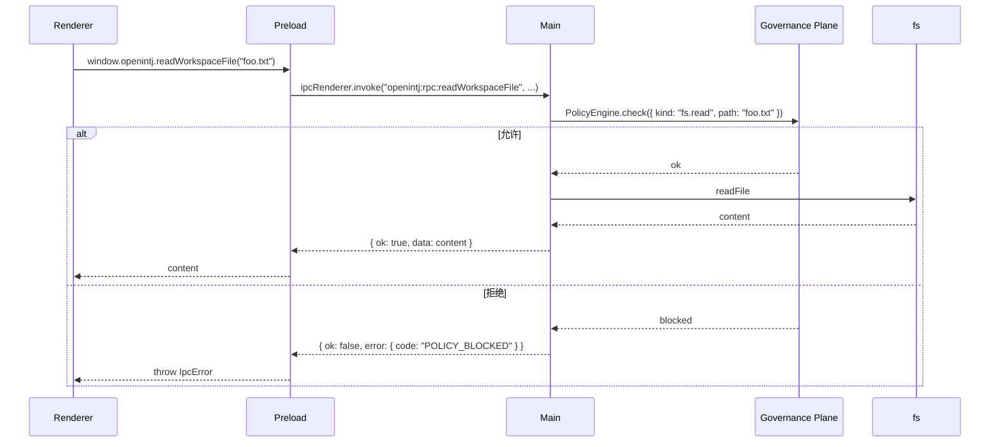

# RFC-004：Electron 桌面客户端 IPC 协议

| 字段 | 值 |
|---|---|
| 状态 | Draft |
| 起草日期 | 2026-04-29 |
| 决策日期 | TBD（Phase 3 启动前） |
| 作者 | OpenINTJ Core |
| 上游决策 | 路线图 D3-D6（Electron + React + shadcn + Local-first，已确认） |
| 影响包 | `@openintj/desktop` |
| 实现阶段 | Phase 3 |

---

## 1. 安全模型与基本要求

桌面客户端遵循 Electron 官方推荐的 **隔离 + 最小权限** 模式：

| 设置 | 值 | 原因 |
|---|---|---|
| `contextIsolation` | `true` | renderer 与 main 完全隔离，preload 只能通过 contextBridge 暴露 API |
| `nodeIntegration` | `false` | renderer 不能直接 require Node 模块 |
| `sandbox` | `false`（暂时） | 因为 preload 需要 require Electron 的 ipcRenderer；Phase 3 后期评估改为 true（用 sandbox 兼容方式） |
| `webSecurity` | `true` | 启用 same-origin policy |
| `allowRunningInsecureContent` | `false` | |
| CSP | `default-src 'self'; script-src 'self'; style-src 'self' 'unsafe-inline'` | 开发模式可放宽，生产强约束 |

**核心规约**：renderer **不直接调用** core 包；所有 OpenINTJ 能力（loop、planes、storage、LLM）都在 main 进程实例化，renderer 通过 IPC 调用。这样：

- 把 LLM API key、本地文件操作、向量库句柄等敏感资源严格限制在 main
- renderer 哪怕被 XSS 也无法直接访问敏感能力（必须通过有限的 IPC 接口）

## 2. 进程拓扑

```mermaid
flowchart LR
    subgraph mainProc [Electron Main Process]
      core[OpenINTJ Core<br/>TaoLoop / Hooks / Planes]
      ipcMain[ipcMain handlers]
      core <--> ipcMain
    end
    subgraph preload [Preload Script]
      bridge[contextBridge<br/>exposeInMainWorld 'openintj']
    end
    subgraph rendererProc [Renderer Process]
      reactApp[React + shadcn UI]
      reactApp -->|window.openintj.*| bridge
    end
    bridge <-->|ipcRenderer.invoke / on| ipcMain

    subgraph utility [Utility Process]
      worker[Distillation Worker<br/>跨会话模式挖掘]
    end
    core -.utilityProcess.fork.-> worker
```

- **Main**：拥有 `OpenintjFramework` 单例 + 所有 plane 实例 + LanceDB/SQLite 句柄
- **Preload**：唯一桥；通过 `contextBridge.exposeInMainWorld("openintj", api)` 暴露白名单 API
- **Renderer**：纯 UI；通过 `window.openintj.*` 访问能力
- **Utility Process**：钝化记忆蒸馏 worker（Phase 4）；用 `utilityProcess.fork` 隔离 CPU 密集任务，不阻塞 main 事件循环

## 3. IPC 通道命名规范

所有 channel 都以 `openintj:` 前缀避免冲突，分四组：

| 组 | 前缀 | 通信模式 | 用途 |
|---|---|---|---|
| RPC | `openintj:rpc:*` | request/response (`invoke`/`handle`) | 同步式调用，有返回值 |
| Stream | `openintj:stream:*` | server→client 流（`webContents.send` + `ipcRenderer.on`） | LLM 流式响应、TAO 进度推送 |
| Event | `openintj:event:*` | server→client 单播事件 | 钩子事件、状态变更通知 |
| Bidirectional Pull | `openintj:pull:*` | client→server 订阅型 | renderer 主动订阅某 trace 的事件流 |

## 4. 暴露面（OpenintjAPI）

```typescript
// packages/shared/src/ipc-types.ts
// 该类型同时被 main、preload、renderer 三方引用，是 IPC 协议的"单一事实源"

export interface OpenintjAPI {
  // -------- RPC --------
  /** 启动一次 TAO 循环，返回 traceId（响应通过 stream 通道异步推送）。 */
  runTao(req: RunTaoRequest): Promise<{ traceId: string }>;
  /** 同步获取 framework 状态。 */
  getStats(): Promise<FrameworkStats>;
  /** 获取 LLM 状态。 */
  getLlmStatus(): Promise<LlmStatus>;
  /** 获取审计日志。 */
  getAuditTrail(opts?: { limit?: number }): Promise<AuditEvent[]>;
  /** 列出钝化记忆中的待审批 pattern（Phase 4）。 */
  listPendingPatterns(): Promise<Pattern[]>;
  /** 批准/驳回 pattern（Phase 4）。 */
  approvePattern(patternId: string): Promise<void>;
  rejectPattern(patternId: string, reason: string): Promise<void>;
  /** 配置变更。 */
  updateConfig(patch: Partial<FrameworkConfig>): Promise<FrameworkConfig>;
  getConfig(): Promise<FrameworkConfig>;

  // -------- Stream（接收方） --------
  /** 订阅指定 trace 的进度流（thought / action / observation / final）。 */
  onTaoProgress(traceId: string, listener: (event: TaoProgressEvent) => void): UnsubscribeFn;
  /** 订阅全局钩子事件流（用于推理调试 panel）。 */
  onHookEvent(listener: (event: HookEventEnvelope) => void): UnsubscribeFn;
  /** 订阅 LLM 状态变化（连上/掉线/限流等）。 */
  onLlmStatusChange(listener: (status: LlmStatus) => void): UnsubscribeFn;

  // -------- 系统能力 --------
  /** 选择本地工作区目录。 */
  pickWorkspaceDir(): Promise<string | null>;
  /** 读取/写入工作区文件（受治理策略约束）。 */
  readWorkspaceFile(relPath: string): Promise<string>;
  writeWorkspaceFile(relPath: string, content: string): Promise<void>;
  /** 监听工作区变化。 */
  onWorkspaceChange(listener: (event: WorkspaceChangeEvent) => void): UnsubscribeFn;
}

export type UnsubscribeFn = () => void;

export interface RunTaoRequest {
  query: string;
  shaderMode?: ShaderMode;
  imageData?: { base64: string; mimeType: string; sizeBytes: number };
  /** 临时覆盖 ReAct 配置。 */
  reactOverrides?: Partial<ReactConfig>;
}

export interface TaoProgressEvent {
  traceId: string;
  phase: "think" | "act" | "observe" | "completed" | "error";
  iteration: number;
  payload:
    | { kind: "react.thought"; content: string }
    | { kind: "react.action"; tool: string; params: unknown }
    | { kind: "react.observation"; toolResult: ToolCallResult }
    | { kind: "react.final"; answer: string }
    | { kind: "tao.observe"; metrics: Record<string, number> }
    | { kind: "error"; code: string; message: string };
  timestamp: number;
}
```

## 5. 错误传递

IPC 调用约定：

- **业务错误**：返回 `{ ok: false, error: { code, message, retriable, details } }`，不抛异常
- **协议错误**（如 channel 名错、payload 验证失败）：抛异常，renderer 端 catch
- **传输错误**（main 进程崩溃等）：Electron 自动 reject 对应的 invoke promise；renderer 应有全局重连兜底

```typescript
export type IpcResult<T> = { ok: true; data: T } | { ok: false; error: IpcError };

export interface IpcError {
  code: string;          // 对齐 Python ErrorCode（CONFIG_MISSING / VALIDATION_ERROR / POLICY_BLOCKED 等）
  message: string;
  retriable: boolean;
  details?: Record<string, unknown>;
}
```

main 端的 handler 包装器统一处理 try/catch：

```typescript
// apps/desktop/src/main/ipc/wrap.ts

export function wrap<TArgs, TReturn>(
  fn: (args: TArgs) => Promise<TReturn>,
): (event: IpcMainInvokeEvent, args: TArgs) => Promise<IpcResult<TReturn>> {
  return async (_event, args) => {
    try {
      const data = await fn(args);
      return { ok: true, data };
    } catch (e) {
      // 把 AgentError 翻译为 IpcError；其他 Error 包装为 INTERNAL_ERROR
      return { ok: false, error: toIpcError(e) };
    }
  };
}
```

## 6. Schema 校验

所有 IPC payload 都用 zod schema 校验。schema 定义集中在 `packages/shared/src/ipc-schemas.ts`：

```typescript
import { z } from "zod";

export const RunTaoRequestSchema = z.object({
  query: z.string().min(1).max(50000),
  shaderMode: z.enum(["high_fidelity", "low_fidelity", "hybrid", "adaptive"]).optional(),
  imageData: z
    .object({
      base64: z.string(),
      mimeType: z.enum(["image/jpeg", "image/png", "image/gif", "image/webp"]),
      sizeBytes: z.number().int().positive().max(5 * 1024 * 1024),
    })
    .optional(),
  reactOverrides: z.record(z.unknown()).optional(),
});

export type RunTaoRequest = z.infer<typeof RunTaoRequestSchema>;
```

main 端在 handler 入口先 `RunTaoRequestSchema.parse(args)`，失败时返回 `IpcError(code: "VALIDATION_ERROR")`。

## 7. 流式响应实现

LLM 流式响应、TAO 进度都用"main 推送 + renderer 监听 + ack"的模式：

```typescript
// main side
ipcMain.handle("openintj:rpc:runTao", wrap(async (req: RunTaoRequest) => {
  const traceId = crypto.randomUUID();
  // 异步启动循环；通过 stream 通道推送进度
  void (async () => {
    const win = BrowserWindow.fromWebContents(/* ... */);
    for await (const evt of taoLoop.runStream(req.query)) {
      win?.webContents.send(`openintj:stream:tao:${traceId}`, evt);
    }
    win?.webContents.send(`openintj:stream:tao:${traceId}`, { phase: "completed" });
  })();
  return { traceId };
}));

// renderer side (via preload bridge)
const onTaoProgress: OpenintjAPI["onTaoProgress"] = (traceId, listener) => {
  const channel = `openintj:stream:tao:${traceId}`;
  const handler = (_e: any, evt: TaoProgressEvent) => listener(evt);
  ipcRenderer.on(channel, handler);
  return () => ipcRenderer.removeListener(channel, handler);
};
```

**背压**：renderer 处理慢时，main 的 send 不会阻塞；为防内存爆，main 端为每个 traceId 维护一个有界 ring buffer（默认 1000 条），超出时丢最旧并打警告（用 `event.STREAM_DROPPED` 通知用户）。

## 8. 系统能力的治理边界

renderer 通过 IPC 请求 `readWorkspaceFile` 等系统能力时，main 端走完整治理链：



工作区路径默认绑定到用户在首次启动时选择的根目录；任何越界路径（含 `..`、绝对路径转义）一律拒绝。

## 9. 自动更新

`electron-updater` + GitHub Releases：

```typescript
// apps/desktop/src/main/updater.ts
import { autoUpdater } from "electron-updater";

export const setupAutoUpdater = (): void => {
  autoUpdater.autoDownload = false;
  autoUpdater.on("update-available", (info) => {
    // 通过 IPC 通知 renderer：openintj:event:updateAvailable
  });
  autoUpdater.on("update-downloaded", (info) => {
    // 通知 renderer：openintj:event:updateReady
  });
  void autoUpdater.checkForUpdates();
};
```

更新策略：

- 启动时静默检查；有更新时仅通知，不强制
- 用户手动确认后下载并重启安装
- 关键安全更新可启用强制（v3.x 后期再开）

## 10. 性能与资源约束

| 指标 | 目标 |
|---|---|
| 应用启动到首屏可交互 | < 2s（冷启动，不计 Ollama 拉模型） |
| IPC 单次 RPC 延迟（轻负载） | P95 < 5ms |
| Stream 推送延迟（main→renderer） | P95 < 10ms |
| 内存（idle） | < 200MB（不含 Ollama）|
| 内存（一次 TAO 循环含 5 轮 ReAct） | < 350MB |

## 11. 测试策略

- **单元**：preload bridge 类型导出测试；wrap 错误翻译测试
- **集成（Vitest + electron-mock）**：模拟 ipcRenderer/ipcMain，验证完整 RPC 来回 + 流推送
- **E2E（Playwright + electron）**：启动应用，跑 "你好" → 看到流式响应渲染 → 看到推理调试 panel 收到 hook event
- **安全**：尝试从 renderer 直接 require Node 内置模块，应失败；尝试越界路径访问，应被治理拒绝

## 12. 未决问题

- **Q1**：是否引入 [`@electron-toolkit/preload`](https://github.com/alex8088/electron-toolkit) 复用？倾向是，能省一半样板代码
- **Q2**：utility process 与 main 之间的进一步隔离（共享 LanceDB 句柄 vs 各自独立连接），需要在 Phase 4 蒸馏 worker 实现时定
- **Q3**：renderer 端的 traceId 与 hookBus 的 traceId 是否合并为一个全局体系？倾向是（避免 trace 拼接），但需 RFC-002 协调

## 附录：IPC channel 完整清单

| Channel | 方向 | Payload | 说明 |
|---|---|---|---|
| `openintj:rpc:runTao` | R→M | RunTaoRequest | 启动 TAO，返回 traceId |
| `openintj:rpc:getStats` | R→M | none | 获取框架状态 |
| `openintj:rpc:getLlmStatus` | R→M | none | LLM 连接状态 |
| `openintj:rpc:getAuditTrail` | R→M | { limit? } | 审计日志 |
| `openintj:rpc:getConfig` | R→M | none | 当前配置 |
| `openintj:rpc:updateConfig` | R→M | Partial<FrameworkConfig> | 更新配置 |
| `openintj:rpc:listPendingPatterns` | R→M | none | 待审批模式（Phase 4） |
| `openintj:rpc:approvePattern` | R→M | { patternId } | 批准模式 |
| `openintj:rpc:rejectPattern` | R→M | { patternId, reason } | 驳回模式 |
| `openintj:rpc:pickWorkspaceDir` | R→M | none | 弹出目录选择对话框 |
| `openintj:rpc:readWorkspaceFile` | R→M | { relPath } | 读文件（治理） |
| `openintj:rpc:writeWorkspaceFile` | R→M | { relPath, content } | 写文件（治理） |
| `openintj:stream:tao:<traceId>` | M→R | TaoProgressEvent | TAO 进度流 |
| `openintj:event:hook` | M→R | HookEventEnvelope | 钩子事件流 |
| `openintj:event:llmStatus` | M→R | LlmStatus | LLM 状态变化 |
| `openintj:event:workspaceChange` | M→R | WorkspaceChangeEvent | 工作区变化 |
| `openintj:event:updateAvailable` | M→R | UpdateInfo | 自动更新 |
| `openintj:event:streamDropped` | M→R | { traceId, dropped } | 流积压告警 |
