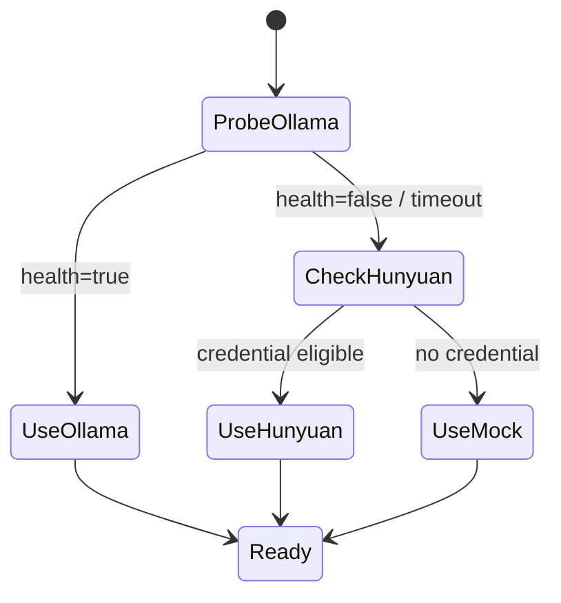
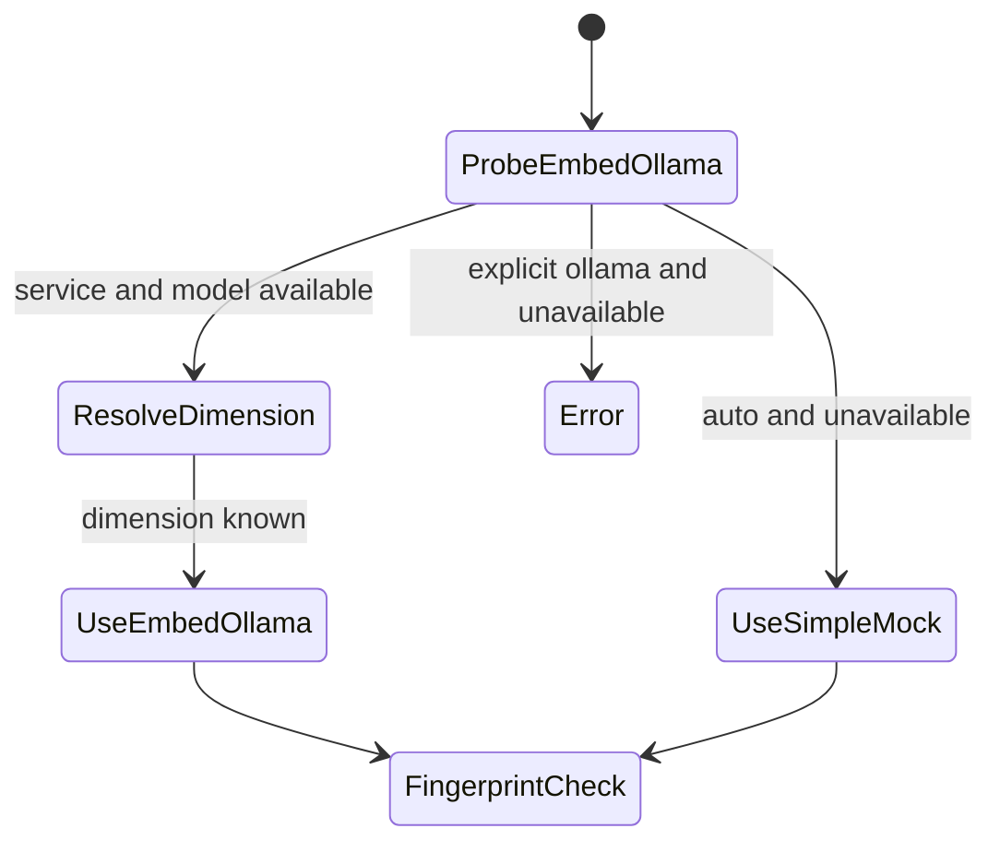

# RFC-005：本地优先模型运行时与 Provider 选择

| 字段 | 值 |
|---|---|
| 状态 | Draft |
| 起草日期 | 2026-07-14 |
| 决策日期 | TBD |
| 作者 | OpenINTJ Core |
| 关联决策 | [ADR-001](../architecture/adr-001-react-tool-protocol.md)、[ADR-002](../architecture/adr-002-provider-selection-fallback.md) |
| 影响包 | 新建 `@openintj/model-runtime`；调整三端装配、LLM/embed adapter、memory persistence、desktop IPC |
| 实现阶段 | Model Runtime Phase 1-4 |

---

## 0. 摘要

OpenINTJ 新建 `packages/llm/runtime`，包名为 `@openintj/model-runtime`，集中负责：

- 分别解析并选择 LLM provider 与 embedding provider；
- 实现一致的本地优先策略、严格的显式选择语义和可观测状态；
- 向 CLI、Server、Desktop 提供同一套装配契约；
- 在打开持久化向量数据前校验 embedding 的 `provider/model/dimension` 指纹。

默认 `auto` 的 LLM 选择顺序为：

1. Ollama 健康：使用 Ollama；
2. Ollama 不健康且存在有效的 Hunyuan 凭据：使用 Hunyuan；
3. 两者均不可用：进入**可见的 mock 模式**。

用户显式选择 `ollama` 时，连接、模型或请求失败必须报错，禁止静默返回 mock 内容。LLM 与 embedding 独立选择；Hunyuan 凭据不会改变 embedding 的选择。

本 RFC 不改变 [ADR-001](../architecture/adr-001-react-tool-protocol.md) 已采纳的 `Thought/Action/Action-Input/FINAL` 文本工具协议。

## 1. 背景与现状

当前实现已经有可复用 adapter，但装配行为不一致：

- CLI 的 `pickLlm()` 支持 `auto`，但顺序是 Hunyuan 凭据优先、Ollama 次之；
- Server 和 Desktop 没有 `auto`，默认走 mock；
- 三端分别实现 `pickLlm()` / `buildLlm()`，没有共享状态机；
- `OllamaClient` 在部分 HTTP/网络错误时直接生成 mock 响应；
- `HunyuanClient` 在无 key 或鉴权失败时直接生成 mock 响应；
- `OllamaEmbedder` 会抛错，由调用方决定降级，但三端尚未把它接入统一装配；
- `createPersistentMemoryStore()` 默认使用 `SimpleEmbedder` 和 64 维向量，只把 `embeddingDim` 传给 LanceDB；
- LanceDB 的向量列是固定维度，但 SQLite/LanceDB 中没有记录 embedding provider 和 model。同维度不同模型也可能被错误复用；
- Desktop 配置只保存一个 `llmProvider`，状态协议只稳定暴露 `provider/status/model`。

因此，仅在各入口修改默认值不能满足目标：选择策略、错误语义、状态和持久化身份必须成为一个跨入口契约。

## 2. 目标

1. 三端通过同一个 runtime 选择 provider，不再复制选择逻辑。
2. 默认本地优先，同时允许用户明确选择云端、Ollama 或 mock。
3. 区分“用户显式选择”与“auto 选择”，避免错误被 mock 内容掩盖。
4. LLM 与 embedding 可独立配置、独立选择、独立展示状态。
5. 状态至少暴露实际 `provider/model/mode/fallbackFrom/lastError`。
6. 持久化数据带 embedding 指纹；不匹配时拒绝 hydrate、检索和写入。
7. 保持现有 `LlmClient`、`EmbeddingProvider` 的核心调用形态可适配，降低三端改造面。
8. 保持 ADR-001 文本工具协议和现有 TAO/ReAct 上层语义。

## 3. 非目标

- 首期不实现 token streaming；`chat()` 仍返回完整字符串。
- 首期不实现 OpenAI-compatible provider；现有 `llm/openai-compat` placeholder 不纳入选择集合。
- 不在线重算或迁移已有 embedding。
- 不在一次进程生命周期内自动混用不同 embedding provider/model。
- 不引入自动模型下载、Ollama 进程托管或 GPU 调度。
- 不改变工具协议为 OpenAI function-calling。
- 不把 runtime 放入 `@openintj/shared`。

## 4. 术语

| 术语 | 定义 |
|---|---|
| requested provider | 用户或配置请求的值，如 `auto`、`ollama` |
| actual provider | runtime 最终实际使用的 provider |
| explicit selection | requested provider 不是 `auto` |
| fallback | `auto` 按候选顺序从不可用候选转到下一候选 |
| mock | 明确标记的非生产 provider；返回确定性测试/演示响应 |
| health probe | 不产生聊天内容的轻量可用性检查，如 Ollama `/api/tags` |
| credential eligibility | 凭据存在且非空；只表示可尝试云端，不保证调用成功 |
| embedding fingerprint | 向量语义身份：`provider + model + dimension` |
| resolution | 从配置与探测结果得到 actual provider 的过程 |

“mock fallback”不是静默行为：状态、日志和 UI 都必须显示实际 provider 为 `mock` 以及 `fallbackFrom`。

## 5. 包边界与依赖方向

### 5.1 新包

路径与包名固定为：

```text
ts/packages/llm/runtime/
package name: @openintj/model-runtime
```

虽然目录位于 `packages/llm`，它同时编排 LLM 与 embedding；“model runtime”比“LLM selector”更准确。

### 5.2 依赖方向

```mermaid
flowchart TB
  apps[CLI / Server / Desktop] --> runtime[@openintj/model-runtime]
  runtime --> core[@openintj/core interfaces]
  runtime --> llmOllama[@openintj/llm-ollama]
  runtime --> llmHunyuan[@openintj/llm-hunyuan]
  runtime --> embedOllama[@openintj/embed-ollama]
  runtime --> mock[explicit mock adapters]
  memory[@openintj/plane-memory] --> core
  apps --> memory
  apps -->|resolved embedder + fingerprint| memory
  core --> shared[@openintj/shared]
```

`@openintj/model-runtime` 不得放进或由 `@openintj/shared` 承载。当前 `core -> shared`，provider adapter 又依赖 `core`；若 `shared` 反向导入 runtime/provider，会形成 `shared -> runtime -> adapter -> core -> shared` 的依赖环。`shared` 继续只放无 provider 依赖的通用值对象和辅助函数。

runtime 可以依赖 core 的 `LlmClient` / `EmbeddingProvider` 接口以及具体 adapter；core、shared 和具体 adapter 不得反向依赖 runtime。

## 6. 配置模型与优先级

### 6.1 配置类型

```typescript
export type LlmProviderSelection = "auto" | "ollama" | "hunyuan" | "mock";
export type EmbeddingProviderSelection = "auto" | "ollama" | "mock";

export interface ModelRuntimeConfig {
  llm: {
    provider: LlmProviderSelection;
    ollama: {
      baseUrl: string;
      model: string;
      visionModel: string;
      timeoutMs: number;
    };
    hunyuan: {
      apiKey: string;
      baseUrl: string;
      model: string;
      visionModel: string;
      timeoutMs: number;
    };
  };
  embedding: {
    provider: EmbeddingProviderSelection;
    ollama: {
      endpoint: string;
      model: string;
      dimension?: number;
      timeoutMs: number;
    };
    mock: {
      model: "simple-sha256";
      dimension: number;
    };
  };
  probeTimeoutMs: number;
}
```

Hunyuan 不出现在 embedding provider 联合类型中。首期没有 Hunyuan embedding adapter，不能因为 LLM 回退到 Hunyuan 就改变 embedding。

### 6.2 配置来源优先级

从高到低：

1. 进程内显式 overrides（CLI flag、`assemble*Agent(opts)`、测试注入）；
2. 进程环境变量；
3. Desktop 已持久化的 `config.json`；
4. runtime 默认值。

`.env.local` / `.env` 由现有 `loadOpenintjEnv()` 注入 `process.env`，不是新的优先级层。加载器不覆盖 shell 中已有变量，因此 shell 环境天然高于文件。

调用方不得先把来源无标记地混成一个对象再自行猜优先级；统一使用：

```typescript
resolveModelRuntimeConfig({
  overrides,
  env: process.env,
  persisted,
}): ModelRuntimeConfig
```

三端映射：

| 入口 | overrides | persisted | 默认 |
|---|---|---|---|
| CLI | `--provider` 及后续 embedding flags | 无 | LLM `auto`，embedding `auto` |
| Server | `assembleServerAgent(opts)` | 无 | LLM `auto`，embedding `auto` |
| Desktop | main 进程启动参数 | `userData/config.json` | LLM `auto`，embedding `auto` |

### 6.3 环境变量

| 变量 | 含义 |
|---|---|
| `LLM_PROVIDER` | `auto\|ollama\|hunyuan\|mock` |
| `EMBEDDING_PROVIDER` | `auto\|ollama\|mock` |
| `OLLAMA_BASE_URL` | LLM Ollama 地址 |
| `OLLAMA_MODEL` | LLM 文本模型 |
| `OLLAMA_VISION_MODEL` | LLM 视觉模型 |
| `OLLAMA_TIMEOUT_MS` | LLM 请求超时 |
| `OLLAMA_EMBED_ENDPOINT` | embedding Ollama 地址；未设置时可兼容 `OLLAMA_ENDPOINT`，再回落到 LLM 地址 |
| `OLLAMA_EMBED_MODEL` | embedding 模型 |
| `OLLAMA_EMBED_DIMENSION` | 已知维度；实际响应仍必须校验 |
| `HUNYUAN_API_KEY` | Hunyuan 资格判断与鉴权 |
| `HUNYUAN_BASE_URL` / `HUNYUAN_MODEL` | Hunyuan 地址与模型 |

禁止记录 API key 值；配置摘要只可记录 `hasCredential: true/false`。

## 7. Provider 选择状态机

### 7.1 LLM `auto`



规则：

- Ollama probe 有独立短超时，不能使用聊天请求超时拖慢启动。
- `/api/tags` 成功还必须确认配置的文本模型存在；“服务在线但模型未安装”视为该候选不可用。
- Hunyuan 首期只做凭据资格判断，不用付费聊天请求做启动探测。
- 若选择 Hunyuan 后首次真实请求失败，错误必须向上返回并更新状态；首期不在同一请求中伪装为 mock。
- auto 落到 mock 时，`actualProvider="mock"`、`mode="mock"`，并产生 warning 级事件。

### 7.2 LLM 显式选择

| requested | 行为 |
|---|---|
| `ollama` | probe 服务与模型；失败抛 `MODEL_PROVIDER_UNAVAILABLE`，不得 mock |
| `hunyuan` | 缺凭据在装配期抛 `MODEL_CREDENTIAL_MISSING`；鉴权/请求失败向上抛，不能 mock |
| `mock` | 明确构造 mock adapter，状态为 mock |

这要求 Ollama/Hunyuan adapter 增加 strict 行为或把 mock 生成从真实 adapter 中移出。runtime 不得通过检查 adapter 的 `isMockMode` 来接受一次“看似成功”的真实调用。

### 7.3 Embedding 独立状态机



- `embedding.provider=auto`：Ollama embedding 可用则使用；否则使用 `simple-sha256` mock。
- `embedding.provider=ollama`：失败必须报错。
- `embedding.provider=mock`：明确使用 `SimpleEmbedder`。
- embedding resolution 在持久化工厂打开/复用向量表之前完成。
- store 打开后不热切换 embedding；要切换必须关闭 store、重新 resolution 并通过指纹检查。

### 7.4 `fallbackFrom`

`fallbackFrom` 表示最终 actual provider 的直接前驱候选：

- LLM auto 从 Ollama 转 Hunyuan：`fallbackFrom: "ollama"`；
- LLM auto 无 Ollama、无 Hunyuan 凭据而转 mock：`fallbackFrom: "ollama"`，完整尝试原因见 `attempts`；
- embedding auto 从 Ollama 转 mock：`fallbackFrom: "ollama"`；
- 无 fallback 或显式 mock：字段省略。

完整候选链不能只靠该字段推断，必须保留结构化 `attempts`。

## 8. API 契约

### 8.1 创建 runtime

```typescript
export interface CreateModelRuntimeInput {
  config?: DeepPartial<ModelRuntimeConfig>;
  env?: NodeJS.ProcessEnv;
  persisted?: PersistedModelConfig;
  fetch?: typeof globalThis.fetch;
  now?: () => number;
}

export interface ModelRuntime {
  readonly llm: LlmClient;
  readonly embedding: EmbeddingProvider;
  readonly embeddingFingerprint: EmbeddingFingerprint;
  getStatus(): ModelRuntimeStatus;
  refreshHealth(): Promise<ModelRuntimeStatus>;
  close(): Promise<void>;
}

export async function createModelRuntime(
  input?: CreateModelRuntimeInput,
): Promise<ModelRuntime>;
```

工厂必须是异步的，因为 Ollama health/model/dimension resolution 都涉及 I/O。

### 8.2 状态类型

```typescript
export type RuntimeProvider = "ollama" | "hunyuan" | "mock";
export type RuntimeMode = "live" | "mock" | "unavailable";

export interface ProviderAttempt {
  provider: RuntimeProvider;
  outcome: "selected" | "unhealthy" | "model_missing" | "ineligible" | "failed";
  durationMs: number;
  errorCode?: string;
  errorMessage?: string;
}

export interface ProviderRuntimeStatus {
  requestedProvider: "auto" | RuntimeProvider;
  provider: RuntimeProvider;       // 实际 provider
  model: string;                   // 实际 model
  mode: RuntimeMode;
  status: "connected" | "degraded" | "unavailable";
  fallbackFrom?: RuntimeProvider;
  lastError?: {
    code: string;
    message: string;
    retriable: boolean;
    at: number;
  };
  attempts: ProviderAttempt[];
}

export interface ModelRuntimeStatus {
  llm: ProviderRuntimeStatus & {
    visionModel?: string;
    visionSupported: boolean;
  };
  embedding: ProviderRuntimeStatus & {
    dimension: number;
    fingerprint: string;
  };
}
```

对外状态中的 `lastError` 必须脱敏和限长；不得包含 Authorization header、API key、完整响应体或用户 prompt。

### 8.3 错误契约

```typescript
export type ModelRuntimeErrorCode =
  | "MODEL_PROVIDER_UNAVAILABLE"
  | "MODEL_NOT_INSTALLED"
  | "MODEL_CREDENTIAL_MISSING"
  | "MODEL_AUTH_FAILED"
  | "MODEL_REQUEST_FAILED"
  | "EMBEDDING_DIMENSION_UNKNOWN"
  | "EMBEDDING_FINGERPRINT_MISSING"
  | "EMBEDDING_FINGERPRINT_MISMATCH";

export class ModelRuntimeError extends Error {
  readonly code: ModelRuntimeErrorCode;
  readonly retriable: boolean;
  readonly provider?: string;
  readonly cause?: unknown;
  readonly status?: ModelRuntimeStatus;
}
```

三端可以把该错误翻译到现有 CLI stderr、HTTP 错误和 IPC 错误，但不得改变“显式 Ollama 失败就是失败”的语义。

### 8.4 与 core 接口的关系

首期保留 core 的：

```typescript
interface LlmClient {
  chat(...): Promise<string>;
  visionChat(...): Promise<string>;
  getStatus(): LlmStatus;
}

interface EmbeddingProvider {
  readonly name: string;
  readonly dimension: number;
  embed(...): number[] | Promise<number[]>;
  embedBatch(...): number[][] | Promise<number[][]>;
}
```

runtime status 是选择层的事实源；adapter `getStatus()` 是候选自身状态。装饰器（如 rate limit）必须透传 actual provider 状态，不能把 provider 改成装饰器名称。

## 9. Embedding 指纹与持久化

### 9.1 指纹格式

```typescript
export interface EmbeddingFingerprint {
  schemaVersion: 1;
  provider: "ollama" | "mock";
  model: string;
  dimension: number;
}
```

规范化字符串：

```text
v1:<provider>:<model>:<dimension>
```

比较使用全部结构字段，不只比较 hash，也不只比较 dimension。model 保留 provider 返回/配置的稳定标识；首期不解析 mutable tag 背后的模型 digest，后续可增加可选 `revision`。

示例：

```text
v1:ollama:nomic-embed-text:768
v1:mock:simple-sha256:64
```

### 9.2 写入位置与时机

真实持久化模式在 SQLite metadata schema 中增加 singleton store metadata（概念字段）：

```text
key = "embedding_fingerprint"
value = {"schemaVersion":1,"provider":"ollama","model":"nomic-embed-text","dimension":768}
```

`createPersistentMemoryStore()` 接收 resolved embedder 和 fingerprint。初始化顺序必须调整为：

1. resolution 得到 embedding 与确定 dimension；
2. 初始化/迁移 SQLite metadata；
3. 读取持久化 fingerprint 和是否已有 fragment；
4. 校验通过后，才以该 dimension 打开/创建 LanceDB；
5. hydrate memory。

禁止先 hydrate 旧向量再检查。

### 9.3 校验规则

| 存储状态 | 行为 |
|---|---|
| 空存储、无指纹 | 写入当前指纹，允许初始化 |
| 有指纹且完全匹配 | 允许复用 |
| 有指纹但任一字段不同 | 抛 `EMBEDDING_FINGERPRINT_MISMATCH` |
| 有 fragment 但无指纹（旧数据） | 抛 `EMBEDDING_FINGERPRINT_MISSING` |
| in-memory 模式 | 为本次 store 绑定指纹；不跨进程持久化 |

同维度不同 provider/model 仍然不匹配，因为向量空间不可互换。

### 9.4 首期迁移策略

首期不在线迁移、不后台重算，也不“先读旧向量再逐条覆盖”。错误必须给出以下可操作选项：

1. 恢复原 provider/model/dimension；
2. 使用新的 `dataDir`；
3. 用户显式导出原文、清空向量数据后重建。

runtime 不得自动删除数据。未来迁移工具应在独立 RFC 中定义快照、重算、双表切换和回滚。

## 10. 三端配置与装配

### 10.1 CLI

- `--provider` 默认继续接受 `auto|ollama|hunyuan|mock`，默认值为 `auto`。
- 后续增加 `--embedding-provider auto|ollama|mock`；未提供走统一优先级。
- 创建 agent 前先 `await createModelRuntime()`。
- 启动摘要打印 LLM 与 embedding 的 requested/actual/model/mode；fallback 打 warning。
- 显式 Ollama 失败时命令非零退出，不输出 mock 答案。

### 10.2 Server

- `ServerAgentOpts.llmProvider` 增加 `auto` 并默认 `auto`。
- 增加独立 `embeddingProvider` / embedding config。
- `assembleServerAgent()` 把 `runtime.embedding` 和 fingerprint 传给 persistence factory。
- `/status`（或现有 status 输出）返回完整 `modelRuntime`；兼容期可保留 `llm` 投影。
- 装配失败时 server 不监听端口，错误经启动日志输出。

### 10.3 Desktop

`AppConfig` 增加：

```typescript
{
  llmProvider?: "auto" | "ollama" | "hunyuan" | "mock";
  embeddingProvider?: "auto" | "ollama" | "mock";
  llmModel?: string;
  embeddingModel?: string;
}
```

- 默认选择从 mock 改为 auto。
- SettingsPanel 分开显示“LLM 提供方”和“Embedding 提供方”。
- 配置仍按当前约定持久化到 `userData/config.json`，多数模型配置重启生效。
- main 进程持有 runtime；renderer 只通过 IPC 读配置和状态，不能接触凭据。
- StatusBar 至少展示 actual provider/model/mode；发生 fallback 或 lastError 时显示 degraded/warning 入口。
- `StatusResponseSchema` 增加完整 `modelRuntime.llm` 与 `modelRuntime.embedding`，不能只保留三字段 LLM 投影。

### 10.4 兼容过渡

实现期允许短暂保留 `agent.llm` 和现有 `status.llm`：

- `agent.llm` 指向 `runtime.llm`；
- `status.llm` 是 `status.modelRuntime.llm` 的兼容投影；
- 新代码只读取 `modelRuntime`；
- 兼容投影移除时间在实现 PR 中明确，不在本 RFC 强制。

## 11. 可观测性

### 11.1 日志

启动时每个通道一条结构化摘要：

```text
model.runtime.resolved channel=llm requested=auto provider=ollama model=qwen2.5:7b mode=live
model.runtime.resolved channel=embedding requested=auto provider=mock model=simple-sha256 dimension=64 mode=mock fallbackFrom=ollama
```

禁止打印凭据和 prompt。重复 health failure 应限频，避免 Desktop 状态轮询刷屏。

### 11.2 Hook/OTel 事件

至少定义：

- `model.provider.probe`
- `model.provider.selected`
- `model.provider.fallback`
- `model.provider.error`
- `model.embedding.fingerprint.checked`
- `model.embedding.fingerprint.rejected`

推荐 span attributes：

```text
openintj.model.channel = llm | embedding
openintj.model.requested_provider
openintj.model.actual_provider
openintj.model.model
openintj.model.mode
openintj.model.fallback_from
openintj.model.error_code
openintj.embedding.dimension
```

不得把 API key、完整 endpoint query、prompt 或模型响应放入 attribute。

### 11.3 状态一致性

- CLI、HTTP、Desktop IPC 必须投影同一个 `runtime.getStatus()`。
- `lastError` 在后续成功后可以保留为“最近错误”，但 `status` 必须反映当前状态，并带错误时间。
- UI 不得仅凭 requested provider 推断实际 provider。

## 12. 测试策略

### 12.1 单元测试

- 配置来源优先级的全组合测试；
- LLM auto：Ollama 健康、Ollama 不健康 + Hunyuan key、全部不可用三条路径；
- LLM explicit：Ollama 服务不可达、模型缺失、请求 HTTP 错误均不得返回 mock；
- embedding auto/explicit 的独立选择；
- probe timeout、错误脱敏、`fallbackFrom` 和 attempts；
- mock 必须是显式 actual provider，不能伪装为 Ollama/Hunyuan。

### 12.2 Adapter 契约测试

- Ollama strict 模式网络/HTTP/模型错误抛统一错误；
- Hunyuan strict 模式缺 key/鉴权失败不 mock；
- Ollama LLM 与 embedding 的 `/api/tags` 模型检查；
- embed 首次调用推断 dimension 后保持稳定，后续维度变化报错。

### 12.3 持久化测试

- 空库写入指纹并重启复用；
- provider 不同、model 不同、dimension 不同分别拒绝；
- 同维度不同模型仍拒绝；
- 有旧 fragment 无指纹拒绝；
- mismatch 发生时不得 hydrate、不得新增/删除数据；
- in-memory 模式绑定本次 fingerprint；
- Desktop/Server 真盘 e2e 覆盖 `写入 -> 关闭 -> 同指纹重启 -> 读回`。

### 12.4 三端测试

- CLI 显式 Ollama 失败以非零码退出且 stdout 无 mock 答案；
- Server auto 状态与 Desktop auto 状态对同一 probe fixture 一致；
- Desktop config schema 接受 auto 和独立 embedding provider；
- Desktop IPC schema 完整保留 `provider/model/mode/fallbackFrom/lastError`；
- SettingsPanel 与 StatusBar 使用 actual provider；
- 现有 ADR-001 ReAct 文本协议 fixtures 全部保持通过。

## 13. 分阶段实施

### Phase 1：runtime 骨架与严格 adapter

- 新建 `@openintj/model-runtime`；
- 抽出显式 mock adapter；
- 为 Ollama/Hunyuan 增加 strict 错误语义；
- 实现配置解析、health/model probe、状态和单元测试。

### Phase 2：三端 LLM 接线

- CLI、Server、Desktop 删除各自的 provider switch；
- 默认切到 auto；
- 接入统一状态、日志、HTTP/IPC 投影；
- 保持 `agent.llm` 兼容引用。

### Phase 3：独立 embedding 与指纹

- 接入 Ollama/Simple embedding resolution；
- 扩展 persistence factory 与 metadata schema；
- 先校验指纹再打开 LanceDB/hydrate；
- 增加 legacy/mismatch/e2e 测试。

### Phase 4：Desktop 配置与可观测完善

- SettingsPanel 分离两类 provider；
- StatusBar 展示 actual provider/model/mode/fallback；
- 补齐 Hook/OTel、错误脱敏和文档。

每个阶段都必须保持 mock 测试可离线运行；不得要求 CI 安装或启动 Ollama。

## 14. 验收标准

1. 仓库存在 `ts/packages/llm/runtime`，发布名为 `@openintj/model-runtime`，shared 无反向依赖。
2. 三端不再各自实现 provider switch。
3. 无显式配置时，三端均按 Ollama -> Hunyuan credential -> mock 解析 LLM。
4. 显式 `ollama` 在服务不可达、模型缺失或请求失败时可观测报错，绝不返回 mock 内容。
5. LLM 与 embedding 可以选择不同 provider，互不隐式联动。
6. CLI、Server status、Desktop IPC/UI 都显示 actual `provider/model/mode/fallbackFrom/lastError`。
7. 真盘数据在首次写入前记录 embedding `provider/model/dimension` 指纹。
8. 任一指纹字段不匹配时启动拒绝复用，数据保持不变。
9. 旧数据有 fragment 但无指纹时 fail closed，并给出恢复/新目录/显式重建提示。
10. ADR-001 文本工具协议测试无行为变化。
11. token streaming 与 OpenAI-compatible 未被混入首期 API。
12. 全部单元、三端集成和持久化 e2e 测试通过。

## 15. 安全与运维约束

- Desktop renderer 永不接收 Hunyuan API key。
- 状态、错误、OTel 和日志均使用脱敏错误。
- health probe 只访问已配置 provider endpoint，不跟随到不受信任协议；URL schema 仍由 zod 限制。
- mock 回答必须在状态/UI 可辨识，避免被误当作真实模型结果。
- 指纹拒绝不得自动清库或覆盖 metadata。
- 模型配置变更在 Desktop 中明确提示“重启后生效”；重启时仍需经过指纹检查。

## 16. 后续工作

以下能力需要独立 RFC 或本 RFC 的后续修订：

1. token streaming 与取消/背压；
2. OpenAI-compatible adapter 进入正式 provider 集合；
3. embedding 离线/在线迁移工具；
4. Ollama model digest/revision 进入指纹；
5. 运行期 LLM 熔断、自动重解析与恢复策略；
6. 自动下载/管理本地模型。

